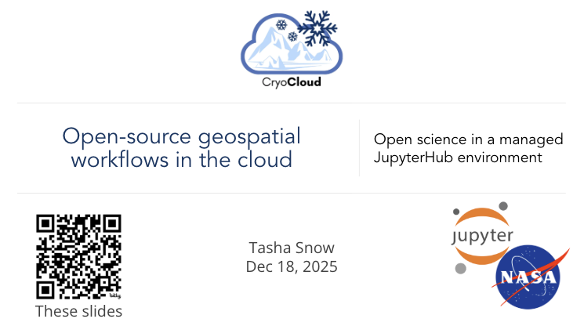
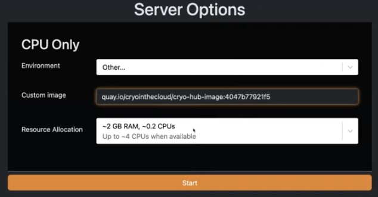
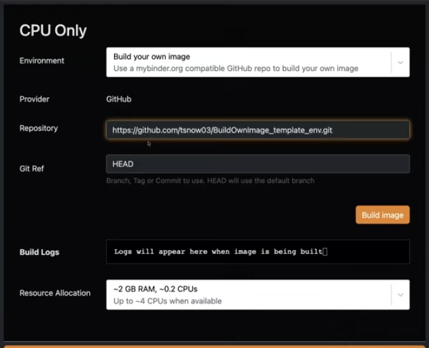

---
authors:
  - name: "Tasha Snow"
    affiliations:
      - "University of Maryland"
      - "NASA Goddard Space Flight Center"
      - "Colorado School of Mines"
    email: "tsnow03@umd.edu"
    orcid: "0000-0001-5697-5470"
    github: "tsnow03"
---

# ❄️ 1 - Working in JupyterHub with CryoCloud

:::{note} 🛝 Slides
:icon: false
:class: dropdown

<iframe
    src="https://docs.google.com/presentation/d/e/2PACX-1vQHM2_0pwRCghPvFFHDvH-KMzD5seeR2D9NkPrFWPyPBSJBsN50uIc81x6rDthVIyroOXqH5rRKPZL7/pubembed?start=false&loop=false&delayms=60000"
    frameborder="0"
    width="960"
    height="569"
    allowfullscreen="true"
    mozallowfullscreen="true"
    webkitallowfullscreen="true">
</iframe>
:::

:::{tip} Learning Objectives
- Learn how to access and use CryoCloud
- Start a Jupyter server in CryoCloud
- Clone the repository for this workshop website
:::


## Access the [CryoCloud powerpoint](https://docs.google.com/presentation/d/1BRWaZUEfBJlKA9WL7jIdL_4jlQ24wohS_GNjYJCFliw/edit?usp=sharing) whenever you need to reference it

Open the powerpoint by directly clicking on the hyperlink above.



---

## Open CryoCloud

1) Scroll through the languages.
   Choose the Python programming language.

2) Scroll through the server sizes. Choose the 7 Gb server.

:::{tip}
**Be realistic about the max memory you will need.
The amount you select, you are guaranteed, but if you use more you risk crashing your
server and having to rerun your analysis.**

**Check your memory usage at the bottom middle of the screen.**
:::

3) Sit back and learn about each of the tools!
    - How to bring your own environment
    - JupyterHub options and viewing setup
    - GitHub
    - Virtual Linux desktop
    - SyncThing
    - Viewing and editing of different files

---

## Bring Your Own environment (custom Docker image)

CryoCloud allows you to launch your server using different software environments. Each environment corresponds to a Docker image, which defines the libraries, tools, and versions available to you. Switching Docker images is similar to switching between computers that have different applications installed.

Using a custom Docker image is useful when you want:
- A different software stack than the defaults
- An older or reproducible version of CryoCloud’s environment
- A specialized environment from an external registry (e.g., Pangeo, Rocker)

This feature is called **Bring Your Own Image (BYOI)**.


### 1. Selecting an environment when launching CryoCloud

When you open CryoCloud, the **Environment** dropdown provides:

- Python
- R
- Matlab
- Other
- Build Your Own

To use a custom Docker image, select **Other**.
A field labeled **Custom image** will appear. This is where you will paste the Docker tag for the environment you want.




### 2. Finding a Docker tag

A Docker tag tells CryoCloud which exact environment to use. You can choose tags from CryoCloud’s maintained images or from Docker Hub.


### Option A: Use an older or alternate CryoCloud environment

CryoCloud publishes its Python environment image to Quay.io, Red Hat’s hosted container image registry service which is free for publicly accessible container images.

1. Visit the repository tags page:
   https://quay.io/repository/cryointhecloud/cryo-hub-image?tab=tags

2. Browse the available tags. Each tag corresponds to a specific version.

3. Copy the full tag in the following form: `quay.io/cryointhecloud/cryo-hub-image:<tag>`

Example:

```
quay.io/cryointhecloud/cryo-hub-image:e457bd429a1e
```

Paste the tag into the **Custom image** field on CryoCloud. For reference, this image is built from the code in: https://github.com/CryoInTheCloud/hub-image.

```{image} ./image_tags.png
:width: 60%
:align: center
```

### Option B: Use an image from Docker Hub

You may also use any public Docker image from Docker Hub.

1. Search for images at:
   https://hub.docker.com/

2. Tags typically follow this format: `account/image:tag`

Example:
```
pangeo/ml-notebook:latest
rocker/geospatial:4.4
```

Paste any valid tag into the **Custom image** field.


### Example: Using a machine learning environment

If you want a Pangeo machine learning environment, enter:
```
pangeo/ml-notebook:latest
```

CryoCloud will launch your session using that environment.


### Tips

- If an image does not launch, ensure it includes a Jupyter-compatible single-user interface.
- Private images requiring authentication are not currently supported through the UI.
- Images must be Linux-based and appropriate for JupyterHub.
- Use explicit tags (not `latest`) when reproducibility is important.

---

## Build Your Own image

CryoCloud also supports creating a fully customized environment using your own `environment.yml` file. This option is useful when you want complete control over the software stack and only want the packages you specify.

When launching CryoCloud, select **Build Your Own** from the **Environment** dropdown.
A field labeled **Repository** will appear. This is where you will paste the URL of a GitHub repository that contains an `environment.yml` file.




### Example: Using a minimal template repository

You can start with a simple example environment from the following template repository:

```
https://github.com/tsnow03/BuildOwnImage_template_env.git
```

To copy the correct link from your own repository:

1. Open your GitHub repository.
2. Click the blue **Code** button.
3. Copy the HTTPS URL (it should end in `.git`).

CryoCloud will use the `environment.yml` found in that repository to build your image.


### Building the Image

1. Paste the repository URL into the **Repository** field.
2. Click **Build image**.

CryoCloud will begin building a Docker image based on your `environment.yml`. Build times vary depending on the number of packages:

- Simple environments: ~30 seconds
- Large or complex environments: up to ~1 hour

If the build process encounters an issue, an error message will appear in the log so you can revise your `environment.yml`.

After the image is built once, you can easily select it again in future sessions.

**Tip:** Test your `environment.yml` locally using Mamba before using Build Your Own to speed up the build process and avoid waiting through repeated failures.

---

## Task: Clone the CryoCloud jupyterbook

We will clone (e.g. make a local copy of) the [workshop repository](https://github.com/geojupyter/workshop-open-source-geospatial.git).

To do this:
1. Select the plus (`+`) sign above the `File Browser` to the left, which will bring up a `Launcher` window.

2. Click the `terminal` button under Other to open it.
   This is your command line like you would have on any computer.

   Before cloning the repo, you have the option to switch to another file folder using
   the _change directory_ terminal command: `cd folder` if you do not want the Hackweek
   repo in your current directory (you can check which directory you are currently in
   using _print working directory_ command: `pwd`).

   ```
   cd yourfoldername
   ```

3. Now clone the workshop code into your current directory:

   ```
   https://github.com/geojupyter/workshop-open-source-geospatial.git
   ```

4. You will see the folder pop into your `File Browser` on the left if you have the current directory open.
   Click on the folder to navigate through the files.

5. To open this tutorial, click on the `materials` subdirectory > `01-working-in-jupyterhub` and double
   click on `index.md`.
   This should open up this tutorial in case you want to review it in the future.


Now after the demo...


---

## Shutting down your JupyterHub

```{tip}
**Best Practice: Shut down the CryoCloud server when you are done to save us money.**

**If you only close your tab or click log out, your server will continue running for 90 minutes.**
```

Whenever you are done, it is best to shut down your server when you sign out to save on money for CryoCloud.
Time on the JupyterHub costs money and there are systems in place to make sure your server doesn't run indefinitely if you forget about it.
After 90 minutes of no use, it will shut down.
We prefer you shut down the server when so we save that 90 minutes of computing cost.

To do so:

- In upper left, click on `File` > `Hub Control Panel`, which will open another tab
- Click the red `Stop Server` button. Once this button disappears after you clicked it, your server is off.
- Click `Log Out` in the top right of your screen and you will be logged out, or you can start a new server
- You can now close this tab and the other tab where you were just working

```{image} ./stop_server.png
:width: 70%
:align: center
```

---

## Summary

🎉 Congratulations!
You've completed this tutorial and have seen how we can access and use CryoCloud.


## References

To learn more about CryoCloud, gain code for NASA data access, and find other Cryosphere tutorials check out this other documentation:

* [CryoCloud JupyterBook](https://book.cryointhecloud.com)
