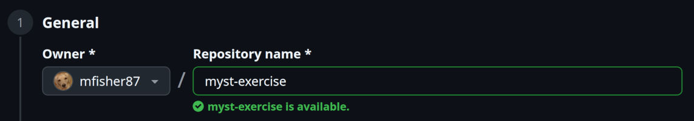
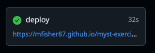
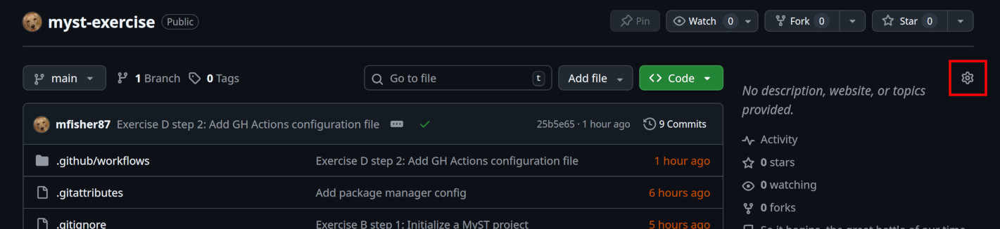
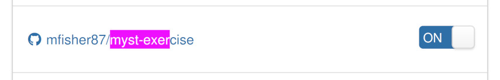
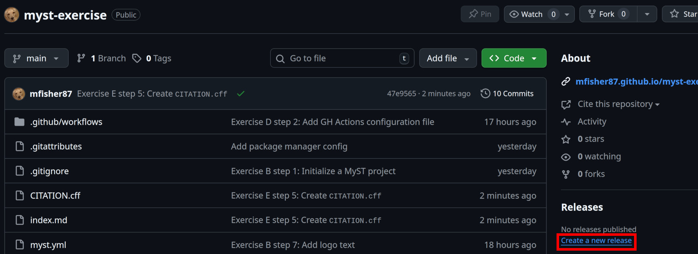
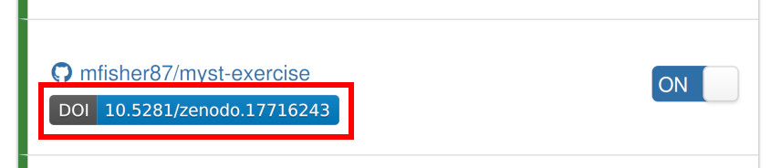

# 📢 5 - Sharing & Publishing Your Work

:::{tip} 🧭 Where we are going
:icon: false

In this tutorial we will build and publish a website and PDF paper from scratch.
We'll publish the website and PDF for free on GitHub, and enable automatic generation of
DOIs for our published product.
:::


## What is MyST?

MyST (Markedly Structured Text) is both a language and a software tool.


### MyST, the language

MyST, as a language, extends Markdown.

It adds new syntax, including
["roles" and "directives"](https://mystmd.org/guide/quickstart-myst-markdown#directives-and-roles)
that enable advanced functionality like
[executable code cells](https://mystmd.org/guide/notebooks-with-markdown#code-cell),
[callouts](https://mystmd.org/guide/admonitions) (also known as admonitions),
and [glossaries](https://mystmd.org/guide/glossaries-and-terms), and more.
There is also dedicated syntax for
[citations](https://mystmd.org/guide/citations#markdown-citations),
[math](https://mystmd.org/guide/math),
and more.

Directives are like functions that can receive Markdown content, for example an
callout's text. Roles are just like directives, except they are _inline_ with other
Markdown text.

Let's jump right into a quick example of how this functionality works.


#### Example directive and role

:::{tip} 💪 Mini-exercise
:icon: false

Try changing the code for the directive and role in the example below and immediately
observe the results.
:::

```{myst}
:::{glossary}
Term
: A word or phrase which can be defined in a **glossary** directive.
Directives can include **_rich_** Markdown content.
:::

{term}`Term` roles create inline references, within your Markdown text, to glossary definitions.
Try hovering over the word "Term" to see a definition.
```


##### 🧠 What do we know now?

The `{glossary}` role enables defining terms, and the `{term}` role enables referencing
terms.


### MySTMD, the software

[MySTMD](https://mystmd.org/) is a software tool for executing and rendering technical
documents from source in MyST or Notebook input formats to multiple output formats
including websites, PDFs, $ \LaTeX $, Typst, MS Word, JATS, and `CITATION.cff`.

MySTMD is the software that created this website from its
[source code](https://github.com/geojupyter/workshop-open-source-geospatial) (written in
MyST and Jupyter Notebook format).


## Building a website with MyST

As workshop participants, you have access to CryoCloud, which provides a JupyterLab
instance with MyST pre-installed.
CryoCloud also comes with a special configuration for building a MyST site without the
use of the terminal.

To preview a MyST site in JupyterLab, view instructions in the reference section [](/reference/04-using-myst.md).

:::{note} The normal way (without JupyterLab)
:class: dropdown

Because we're working in CryoCloud for this workshop, we'll be following the
instructions above for using MyST in JupyterLab.
If you're interested to know how to use MyST outside of JupyterLab, read on!

With MySTMD [installed](https://mystmd.org/guide/installing), you can build a MyST
website from source with one command:

```bash
myst build --html
```

During development, you can also use MyST's convenient preview server to automatically
rebuild your site any time you change its content:

```bash
myst start
```
:::


### 💪 Exercise A: Build _this_ MyST website in JupyterLab

This workshop's materials are built with MyST.
We'll build this premade website together on CryoCloud so you can get used to the
process.

:::{include} /joining-late.md
:::


#### Navigate to the correct directory in the file browser

On the left panel, ensure the JupyterLab file browser tab (📁 icon) is selected.

Double click the folder in the file browser named `workshop-open-source-geospatial`.

:::{youShouldNotice}
...a listing of around a dozen files and directories, including Markdown files and a
file named `myst.yml`.
:::


#### Build the MyST website

Locate the MyST project configuration file, `myst.yml`, in the file browser.

Right click this file and select the top option from the menu: "Build MyST Project".

:::{youShouldNotice}
...a new browser tab opens with a loading spinner and the title "Building MyST Site".

After around 5 seconds, the build will complete and the website content will display
automatically.

At the top-left is the website title: "Open Source Geospatial Workflows in the Cloud".
At the top-right is a button with the text "Rebuild".
:::


#### 🧠 What do we know now?

* A MyST project is configured by a `myst.yml` file
* In JupyterLab, we can right-click `myst.yml` to trigger a build (requires
  [jupyter-myst-build-proxy](https://github.com/ryanlovett/jupyter-myst-build-proxy/))


### 💪 Exercise B: Build a MyST website _from scratch_ in JupyterLab

:::{important} Not covered: _Environment management!_
:class: dropdown

Environment management is an important part of reproducible research.
Always include an environment manifest or specification alongside your publication.

This exercise works as shown on CryoCloud because CryoCloud has MySTMD and many other
dependencies pre-installed.
When working on your own, you may encounter an error like:

```
Command 'myst' not found
```

We highly recommend that you try [pixi](https://pixi.sh/) as a dependency manager:
it's fast, user-friendly, and makes following best practices easy or automatic.

```bash
pixi init
pixi add mystmd
pixi run myst start
```
:::


#### Create a new empty GitHub repository

In the GitHub UI, click the `+` icon at the top-right. Select "New repository".

Select your username as the owner, and enter `myst-exercise` as the repository name.



Leave everything else as default, and click "Create repository".

:::{youShouldNotice}
...GitHub shows you a page for your new, empty repository.

A "Quick setup" section includes a URL you can copy.
:::


#### Clone your repository

From your repository homepage's "Quick setup" menu, select "HTTPS", then copy the URL.

On your JupyterHub server, open a new terminal.

Run these commands, replacing the placeholder with your actual repository URL:

```bash
# Change to your home directory
cd

# Clone the repository
git clone <YOUR_REPOSITORY_HTTPS_URL_HERE>
```

:::{youShouldNotice}
...this command produces the following output:

```
Cloning into 'myst-exercise'...
warning: You appear to have cloned an empty repository.
```

The warning is normal!
:::


#### Initialize your MyST project

First, change directory into your empty repository:

```bash
cd myst-exercise
```

Next, initialize your MyST project with configuration needed to generate a website:

```bash
myst init --project --site
```


#### Create some content

Create a new file `index.md` using the JupyterLab interface:

* Right-click in the empty space in the file browser.
* Select "New file".
* Input the name `index.md`.

Enter the following content in the file (click the copy button at the top-right of this
code block):

```{code} markdown
:filename: index.md

# My document title

Hello, world!

$$
1 + 1 = 2
$$
```

The `$$` symbols delimit a math equation, and you can write any $ \LaTeX $ within.


#### 🧪 Build your site

Right-click the `myst.yml` file in the file browser, and select "Build MyST Project".

:::{youShouldNotice}
...like last time, a new browser tab opens showing a loading spinner while your site
builds.

When it's done, you should see your "Hello, world!" message, plus our amazing math
equation, rendered on the page.


At the top-right, there is a "Rebuild" button.
:::


#### Try some other MyST features

:::{important}
**Keep the tab displaying your website open!**

If you close this tab, you can always re-open it by right-clicking `myst.yml` and
selecting "Build MyST Project" again.
:::

MyST offers many useful features for technical publishing, including
[superscripts and subscripts](https://mystmd.org/guide/typography#subscript-superscript),
[keyboard input notation](https://mystmd.org/guide/typography#keyboard-input),
[abbreviations](https://mystmd.org/guide/typography#abbr-role),
[executable code cells](https://mystmd.org/guide/notebooks-with-markdown#code-cell),
[callouts](https://mystmd.org/guide/admonitions) (also known as admonitions),
[math](https://mystmd.org/guide/math),
[figures](https://mystmd.org/guide/figures),
[diagrams](https://mystmd.org/guide/diagrams),
[asides](https://mystmd.org/guide/asides),
[dropdowns, grids, tabs, cards, buttons](https://mystmd.org/guide/dropdowns-cards-and-tabs),
[glossaries](https://mystmd.org/guide/glossaries-and-terms), and more.

Try out some of these features in your MyST site.


#### 🧪 Rebuild your site

**Each time you make changes, rebuild the site by clicking "Rebuild" at the top-right of
the site.**

Make changes, rebuild, and view the result as many time as you want!


#### Give your site a title

Edit your `myst.yml` file by double-clicking it in JupyterLab.

Uncomment the `title` key and populate a title for your site, e.g. "My site".

Your config file should now look like this:

```{code} yaml
:filename: myst.yml
:linenos:
:emphasize-lines: 5

# See docs at: https://mystmd.org/guide/frontmatter
version: 1
project:
  id: 60e9ac52-956d-4811-800a-68be74a85174
  title: "My site"
  # description:
  # keywords: []
  # authors: []
  github: https://github.com/mfisher87/myst-exercise
  # To autogenerate a Table of Contents, run "myst init --write-toc"
site:
  template: book-theme
  # options:
  #   favicon: favicon.ico
  #   logo: site_logo.png
```

#### 🧪 Rebuild your site

Save and rebuild your site.

:::{youShouldNotice}
...the text near the top-left of your site now says "My site" (or whatever you
chose for your title) instead of "index".

The browser tab should also now be titled "My site".

But it still says "Made with MyST" at the very top!
:::


#### Replace "Made with MyST" text

"Made with MyST" is the default text that appears at the top of your site if
you don't provide a `logo` or `logo_text`.

We can update the text at the very top to replace "Made with MyST" by editing
`myst.yml` again and setting `site.options.logo_text`.
First, uncomment `options:`, then add a line underneath it to set `logo_text`.
**Indentation is important**.

Your config file should now look like this:

```{code} yaml
:filename: myst.yml
:linenos:
:emphasize-lines: 13-14

# See docs at: https://mystmd.org/guide/frontmatter
version: 1
project:
  id: 60e9ac52-956d-4811-800a-68be74a85174
  title: "My site"
  # description:
  # keywords: []
  # authors: []
  github: https://github.com/mfisher87/myst-exercise
  # To autogenerate a Table of Contents, run "myst init --write-toc"
site:
  template: book-theme
  options:
    logo_text: "My logo text"
  #   favicon: favicon.ico
  #   logo: site_logo.png
```

#### 🧪 Rebuild your site

Save and rebuild your site.

:::{youShouldNotice}
...the text near at the very top-left of your site now says "My logo text" (or whatever you
chose for your logo text) instead of "Made with MyST".
:::

:::{gitCommitCheckpoint} Initialize MyST site
:::


#### 🧠 What do we know now?

* `myst.yml` controls what the site looks like, including the title, logo, logo text, and more.
* The `index.md` file is the "home page" for our site by default.
* The development loop for a MyST site in JupyterLab looks like:
  * Right-click `myst.yml` and "Build MyST Project"
  * In the newly opened browser tab, you can view a preview of your MyST site.
  * Change your site content by editing `myst.yml`, Markdown files, or Notebooks.
  * View the results of those changes by clicking "Rebuild" at the top of your site preview.


## Building a PDF with MyST

MyST enables building a PDF from the same source as you built your website.

Some features are web-specific, however, and won't be rendered in an output PDF.

Let's try it out!


### 💪 Exercise C: Render a PDF from the same source as your website

#### Attempt to build our current project as PDF

Building PDF(s) from a MyST project requires one command in the terminal:

```bash
myst build --pdf
```

:::{youShouldNotice}
...this command fails with:

```
📭 No file exports with kind "pdf" found.
You may need to add an 'exports' field to the frontmatter of the file(s) you wish to
export:

---
exports:
- format: pdf
---
```

This is because we need to tell MyST which pieces of the site should be exportable as
PDF.
:::


#### Configure the frontmatter to allow PDF export

To tell MyST that we want a PDF export for a specific document, we need to define {term}`frontmatter`.

While we're here, let's also set some other metadata like the document's author.

Add to the top of `index.md`:

```{code} markdown
:filename: index.md
:linenos:
:emphasize-lines: 1-14

---
authors:
  - name: "Your name"
    affiliations:
      - "Your employer"
    email: "your-email@example.com"
    github: "your-github-username"
    # Optional: Do you have an ORCID?
    # orcid: "0000-0000-0000-0000"
export:
  - format: "typst"
    template: "plain_typst_book"
    output: "paper.pdf"
---

# My document title

Hello, world!
```

:::{hint} On quoting in YAML, a rant
:class: dropdown

YAML is intended to be a human-friendly data format.
There are many ways that it excels at this goal, and in other ways, it introduces
pitfalls that are easy to fall in to.

A single rule will help you avoid many of these pitfalls:
**_always quote strings in your YAML_**.

**Example: Upgrading the Python version**

```yaml
requires_python: 3.9
```

☝️
Looks good to me, and it works fine. I'll just upgrade that to 3.10...

```yaml
requires_python: 3.10
```

🙅
This value isn't a string, it's a number, so it evaluates to 3.1.

```yaml
requires_python: "3.10"
```

✅
The only way to get the result you want is to quote the string.

**Example: ISO country codes**

```yaml
country_code: gb
```

☝️
Looks good to me, and it works fine. I'll just update my program to process data for
Norway...

```yaml
country_code: no
```

🙅
This value isn't a string, it's a **boolean**, so it evaluates to `false`.

```yaml
country_code: "no"
```

✅
The only way to get the result you want is to quote the string.

Save yourself the pain:
**_always defensively quote your YAML strings_**.

There are many more ways YAML can be confusing.
There are a lot of special rules to remember!
For more, check out
[The YAML document from hell](https://ruudvanasseldonk.com/2023/01/11/the-yaml-document-from-hell)
and <https://noyaml.com/>.
:::


#### 🧪 Build the PDF

To build the PDF, try `myst build --pdf` again.

:::{youShouldNotice}
...this command produces the following output at the end:

```
🖨  Rendering typst pdf to paper.pdf
```
:::

Try opening the PDF!
Double-click `paper.pdf` in the JupyterLab file browser.

:::{youShouldNotice}
...the content is fairly simple.
There is a title page, a blank table of contents, and then your content on the 3rd page.
:::

:::{gitCommitCheckpoint} Add PDF export
:::

:::{note} Other PDF templates
:class: dropdown

This document was rendered with the `"plain_typst_book"` template.
Other PDF template options are available!

Try running `myst templates list --typst` to see a list of available templates.

More information is available on the
[official MyST PDF-building documentation](https://mystmd.org/guide/creating-pdf-documents).
:::


#### 🧠 What do we know now?

* MyST documents can be built to multiple output formats, including PDFs.
* Frontmatter is YAML metadata on a Markdown document that can tell MyST which documents
  should be built as PDF.
* [Typst](https://typst.app/) can be used as an alternative document engine to
  $ \LaTeX $ for rendering PDFs by specifying `export.format: "typst"` in the frontmatter.
* If you opened the collapsed section on quoting YAML, you know the author of this
  document has been burned too many times. **Quote your strings**! 😁


## Hosting your website for free

There are many platforms for hosting a website (and PDF!) for free.
We'll discuss some common options for open source projects.


### [GitHub Pages](https://docs.github.com/en/pages)

GitHub Pages is, as it sounds, a GitHub-native solution for hosting web pages.
It doesn't offer any advanced features, it only enables building a website from a GitHub
repository.

Pages are built using [GitHub Actions](https://github.com/features/actions).


### [ReadTheDocs](https://about.readthedocs.com/)

ReadTheDocs is a community service for building and hosting webpages, most commonly
software documentation.
It provides advanced functionality like website previews for Pull Requests,
multi-language builds, and multi-version builds.

It uses
[its own unique file format](https://docs.readthedocs.com/platform/stable/config-file/v2.html)
for specifying build processes.


### 💪 Exercise D: Publish your paper and website to GitHub Pages

We're going to use GitHub Pages because it's more straightforward to configure.
We recommend trying out ReadTheDocs if you need more advanced features!


#### Update repository's GitHub Pages settings

* Open your repository URL in your browser
* Click the "Settings" tab towards the top
* Select "Pages" from the left menu
* Change the "Source" dropdown to "GitHub Actions"


#### Add GitHub Actions configuration file

Now that we've set up our repository to build our website using GitHub Actions,
we need to define the build process in a configuration file.

MyST can do this automatically!
In the terminal, from your `myst-exercise` project directory:

```bash
myst init --gh-pages
```

:::{youShouldNotice}
...this created a new file (and its parent directories) at
`.github/workflows/deploy.yml`.

**You may need to show hidden files so you can see the `.github` directory in the file
browser.
Select View > Show hidden files** from the menu.
:::

:::{gitCommitCheckpoint} Set up publish with GitHub Actions
:::


#### 🧪 View the action results

After committing and pushing the GitHub Actions configuration file in the previous step,
we can view the build that was triggered.

Visit your repository URL in GitHub.
Click the "Actions" tab at the top.

:::{youShouldNotice}
...there is 1 workflow run listed, ideally with a green checkmark.
:::

Click on the workflow run shown on this page.
If it succeeded, you should see a node named "deploy" displayed on the page:



Click the link in the "deploy" node to view your built website.

:::{youShouldNotice}
...your webpage displays on the public Internet!

At the top-right of this page, there's a "download" icon that looks a bit like this:

📥

When you click that icon, you're presented with an option to download your document as a
PDF.

When you download your PDF, it looks exactly like the PDF you built manually earlier!
:::

If your deploy failed, click the "deploy" node to view the error logs.
See if you can solve the error on your own, and let an instructor know if you need help!


#### Display your GitHub Pages URL on your repository homepage

GitHub offers a convenience feature to enable you to view your GitHub Pages URL on the
homepage of your GitHub repo.

Visit the URL for your GitHub repo homepage.
Towards the top-right, click the cog/gear icon (⚙️).



Finally, check the "Use your GitHub Pages website" checkbox, and then click "Save
changes".

:::{youShouldNotice}
...your GitHub Pages URL is visible near the cog/gear icon.
Click the link to immediately open your website.
:::


#### 🧠 What do we know now?

* GitHub repositories need some initial setup in the web interface to publish a MyST
  site built in GitHub Actions.
* MyST can do most of the work of configuring GitHub Actions deployments for us with a
  single command: `myst init --gh-pages`.
* We can see deployment progress and results in the GitHub repository's "Actions" tab.
* MyST will automatically build PDFs when building a website, and generate a download
  link on the relevant page.
* A GitHub repository can display a convenient link to the related GitHub Pages website.


## Getting a DOI

A {term}`DOI` can uniquely identify and track your research products, enabling easy
citing and tracking of citations.
DOIs can even be versioned, enabling citations to reference a research product at a
specific point in time.

DOIs can be associated with your unique academic identity through the use of
an {term}`ORCID`.

:::{important}
A DOI and ORCID can help defend your work against {term}`scooping` by providing
verifiable {term}`provenance` for your work, making it clear that your work came first.

They can also enable credit for the work to be more equitably distributed by crediting
all forms of contributions.
:::

We can automate the production of DOIs with GitHub and [Zenodo](https://zenodo.org/) (a
**free** DOI registrar developed and operated by [CERN](https://home.cern/)).


### 💪 Exercise E: Get a DOI for your published content on GitHub

#### Create an ORCID

Visit the [ORCID registration page](https://orcid.org/register) and create an account.

Enter your **personal email** as your primary email.
Be sure to also enter your institutional email as an additional email.
You can more emails after you register.


#### Sign up for Zenodo

Visit the [Zenodo signup page](https://zenodo.org/signup/) and sign up with either your
GitHub account or ORCID.
We recommend using GitHub, as you'll need to link your GitHub account either way.


##### Link your GitHub account

If you didn't signup with GitHub, you'll need to link your GitHub account.

After you've signed in, click the username dropdown at the top-right of the Zenodo
interface.

On the left panel, select "Linked accounts".

On the GitHub row, click "Connect".
You may be prompted to log in, then you'll be prompted to accept some dialogs.

:::{youShouldNotice}
Back in the Zenodo "Linked accounts" screen, a green checkmark will be
displayed next to GitHub.
:::


#### Enable auto-DOI for your repository on Zenodo

After you've signed in to Zenodo, click the username dropdown at the top-right of the
Zenodo interface.

On the left panel, select "GitHub".

:::{youShouldNotice}
...there is a large "Get started" display with a 3-step process you can follow to enable auto-DOI for a
repository.

At the top right of this "Get started" box, there is a "Sync now" button.
:::

Click "Sync now".
It may take a moment to complete the sync.

:::{hint} Help, I received a `504` error!
:class: dropdown

If you receive a `504` error,
[this is common for users with large numbers of public repositories](https://github.com/zenodo/zenodo-rdm/issues/1118).
Wait a few minutes and refresh the page; eventually your repository list will be updated
:::

Find your repository in the list and flip the switch for that repository
to "ON".




#### Create `CITATION.cff`

A `CITATION.cff` file is the project metadata that enables Zenodo to populate a DOI.

MyST can generate a `CITATION.cff` for you!
But it needs to be told which documents to use to populate this metadata.

Edit `index.md` to add another export format of `"cff"`:

```{code} markdown
:filename: index.md
:linenos:
:emphasize-lines: 14

---
authors:
  - name: "Matt Fisher"
    affiliations:
      - "Schmidt Center for Data Science & Environment"
      - "University of California, Berkeley"
    email: "matt.fisher@berkeley.edu"
    github: "mfisher87"
    orcid: "0000-0003-3260-5445"
export:
  - format: "typst"
    template: "plain_typst_book"
    output: "paper.pdf"
  - format: "cff"
---

# My document title
```

Now we can build our `CITATION.cff` file with the command:

```bash
myst build --cff
```

:::{youShouldNotice}
...the following output:

```
📑 Exported CFF in 37 ms, copying to CITATION.cff
```
:::

:::{gitCommitCheckpoint} Add CITATION.cff for Zenodo DOI
:::

As your project grows and changes, you can regenerate this file by repeating
that command.

You can also edit your citation file by hand -- it's in the YAML format, which may be
familiar to you now!
Check out the
[full CFF specification](https://citation-file-format.github.io/assets/pdf/cff-specifications-1.0.0.pdf)
to see what kind of information you can populate!


#### Create a GitHub release

Zenodo creates DOIs **only** when you create releases in GitHub.

Visit the URL for your GitHub repository's homepage.

Click the "Create a new release" button on the right sidebar.



Click the "Tag" dropdown and click "Create new tag".
We'll use tags to create an ascending numerical sequence for our releases.
For simplicity, let's enter the date in `YYYY.MM.DD` format, e.g. `2025.12.18`.

:::{hint} Versioning schemes
:class: dropdown

There are many
[versioning schemes](https://nesbitt.io/2024/06/24/from-zerover-to-semver-a-comprehensive-list-of-versioning-schemes-in-open-source.html)
to choose from.
The one we suggested above is called ["CalVer"](https://calver.org/) or "calendar versioning".

You may want to try an extremely common versioning scheme called
["SemVer"](https://semver.org/) or "semantic versioning" enables embedding
information about the implications of upgrading to any given version in the
version number itself.
:::

Give your release the title "Initial release".

You don't need to enter anything in the "Release notes" field, but we recommend
using the "Generate release notes" button as a starting place.

:::{hint} "Generate release notes" only generates one line of text!
:class: dropdown

This feature uses
[GitHub Pull Requests (PRs)](https://docs.github.com/en/pull-requests/collaborating-with-pull-requests/proposing-changes-to-your-work-with-pull-requests/about-pull-requests)
to generate a list of changes.
If you don't use PRs, you will only see a "Changelog" link, this is normal.
:::

Finally, **click "Publish release"**.

Zenodo will automatically generate your DOI now.


#### Add a badge to your README

Zenodo also automatically generates a beautiful DOI "badge" you can display on
your repository's README or anywhere else on the web.

To use the badge, click the username dropdown at the top-right of the Zenodo
interface, and select "GitHub".

Locate your repository on the list of enabled repositories and click on the
blue DOI badge:



Copy the "Markdown" code and paste it into a new `README.md` file in your repository:

```{code} markdown
:filename: README.md
:linenos:
:emphasize-lines: 1

[](https://doi.org/10.5281/zenodo.17716242)

# My exercise from the AGU workshop "Open Source Geospatial Workflows in the Cloud"
```

:::{youShouldNotice}
...your repository homepage renders your `README.md` file with a pretty blue badge at the top 🤩

Clicking the badge takes you to the Zenodo homepage for your DOI.
From here, you can generate citations in a variety of formats or download your archived repository as a Zip file.
:::

:::{hint} Writing a useful README
:class: dropdown

The README is the first thing that a user sees when they interact with your repository.

Check out
[The Turing Way's README guide](https://book.the-turing-way.org/project-design/pd-overview/project-repo/project-repo-readme/)
for some thoughts that may help you make your README more useful.
:::

#### 🧠 What do we know now?

* An {term}`ORCID` uniquely identifies ourselves
* A {term}`DOI` uniquely identifies our publication
* A DOI can be associated with an ORCID
* A DOI can help protect us against scooping and more accurately and fairly reflect all
  contributions to the work
* Zenodo can "auto-DOI" a GitHub repository
    * DOIs are automatically generated from GitHub Releases
    * DOIs can be updated over time with changes by creating new GitHub Releases
* We can display our DOI in GitHub with Markdown in our README


## 🎉 Congratulations, you're done!

Great job finishing this module.
If you'd like continued support in applying these skills to your work, please join the
[MyST community on Discord](https://discord.mystmd.org/) and/or ask questions in the
[CryoCloud Slack](https://book.cryointhecloud.com/index-3#slack-account)!
